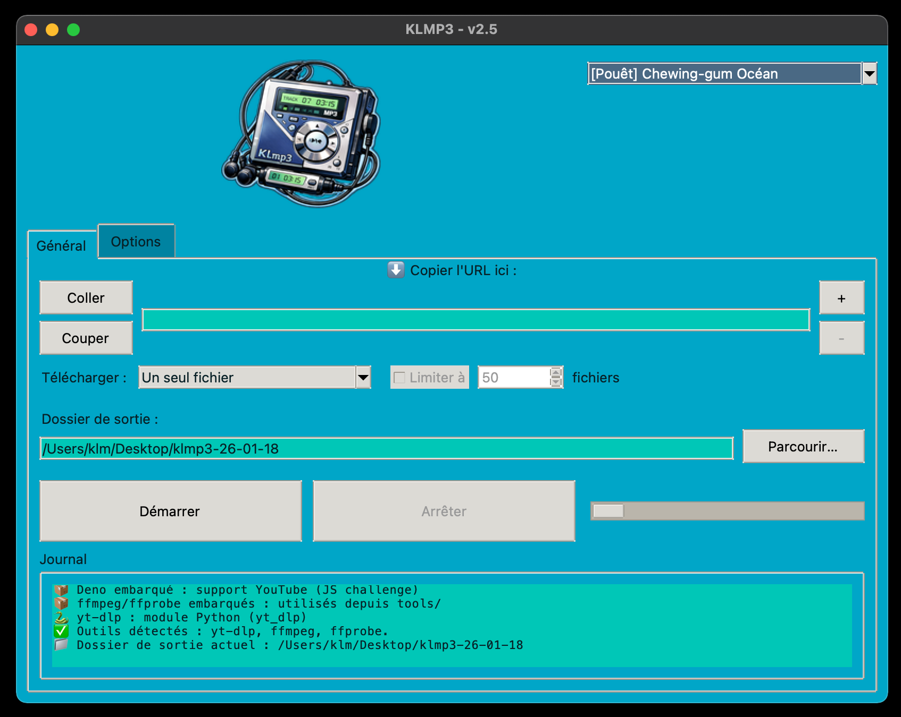
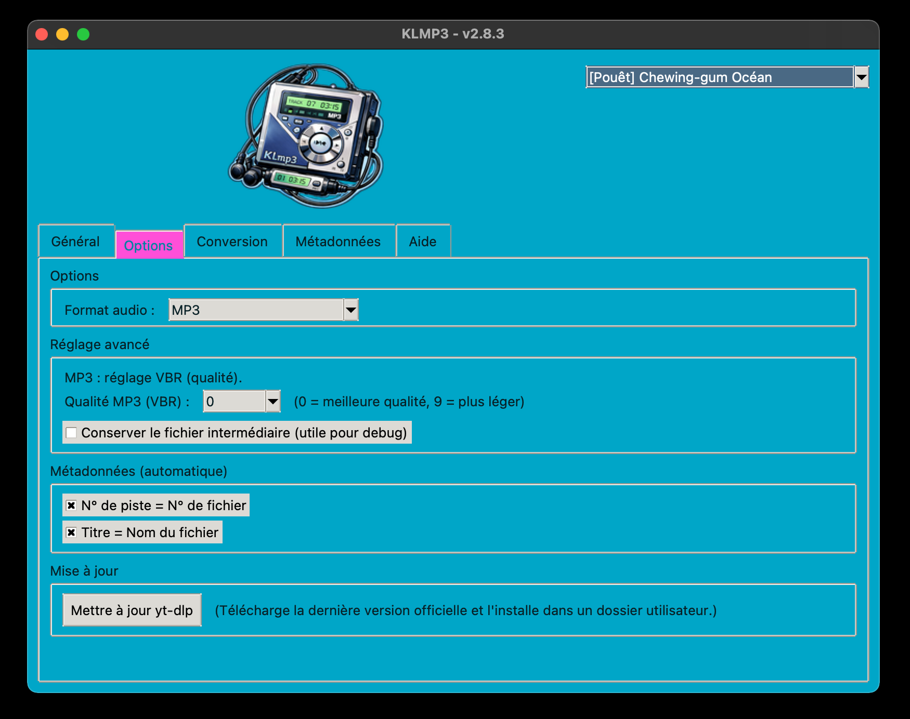

## 🔈️ KLmp3 📢

Extracteur audio YouTube / Twitch simple et multi-OS, écrit en Python + Tkinter.
Objectif : récupérer rapidement de l’audio propre (MP3,M4A,OPUS,FLAC,OGG,WAV) sans dépendre d’un environnement exotique.

---

## Aperçu





---

## 📥 Téléchargement

👉 Les versions compilées sont disponibles ici :  
🔗 [GitHub Releases – KLmp3](https://github.com/mrklm/klmp3/releases)

### Applications standalone (recommandé)

- 🐧 **Linux**  
  *(à venir)*

- 🍎 **macOS**
  - [KLMP3-2.4.1-macOS-x86_64.dmg](https://github.com/mrklm/klmp3/releases)
  - [KLMP3-2.4.1-macOS-x86_64.zip](https://github.com/mrklm/klmp3/releases)

- 🪟 **Windows**  
  - [KLMP3-v2.4-windows-x86_64.zip](https://github.com/mrklm/klmp3/releases)

---         

## Fonctionnalités

🪠 Extraction audio YouTube et Twitch VOD

📋️ File d’attente jusqu’à 10 URLs

📟️ Conversion au choix en MP3, M4A, OPUS, FLAC, OGG, WAV

📺️ Interface graphique légère (Tkinter pur)

📁 Dossier de sortie automatique par date --> ~/klmp3/AA/MM/JJ/

🦏 Détection robuste de ffmpeg / ffprobe (PATH ou tools/)

🗒️ Journal d’exécution intégré

🏳️‍🌈 Thèmes variiés: sombres, clairs et rigolos.

---

 ## 💊 Dépendances:

Python ≥ 3.9

-yt-dlp (module Python)

-ffmpeg / ffprobe

-Installation de yt-dlp :

-python3 -m pip install --user -U yt-dlp


FFmpeg peut être :

-installé sur le système (PATH)

-ou placé dans tools/<platform>/

--- 

## 🚀 Lancement: python3 klmp3.py

Arborescence minimale:

klmp3/

- klmp3.py
- ffmpeg_locator.py
- assets/ logo.png
- tools / ffmpeg + ffprobe

--- 

## 🧪 Utilisation depuis les sources (optionnel)

Pour lancer KLMP3 depuis le code source ou contribuer au projet.

### Pré-requis
- Python ≥ 3.9
- Git

### Installation des dépendances
```bash
python -m pip install -r requirements.txt

Lancement

python klmp3.py

🏗️ Build (développeurs)
Dépendances de build

python -m pip install -r build-requirements.txt

---

✏️ Notes

Aucun accès réseau autre que celui de yt-dlp

Le programme ne modifie pas le PATH système

Fonctionne sous macOS / Linux / Windows

---

📜 Licence

Ce logiciel est distribué sous la GNU General Public License v3.0.

---

🛠️ Contribuer

Les contributions sont les bienvenues via Pull Requests.

---

⚠️ Avertissement

Ce logiciel est fourni **sans garantie**. L'auteur décline 
toute responsabilité en cas de dommage ou de dysfonctionnement.

---

## 💡 Pourquoi ce projet est-il sous licence libre ?

Ce projet s'inscrit dans la philosophie du logiciel libre, promue par des 
associations comme [April](https://www.april.org/). 

Nous croyons que le partage des connaissances et des outils est essentiel
 pour une société numérique plus juste et transparente.

---

📬 Contact:

clementmorel@free.fr

---

🎧️ Bonne écoute avec KLmp3 !


