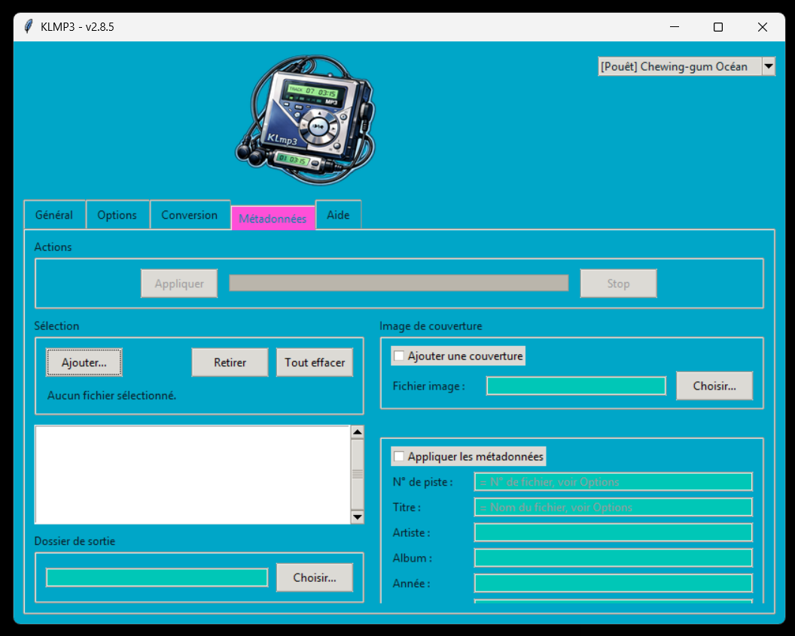
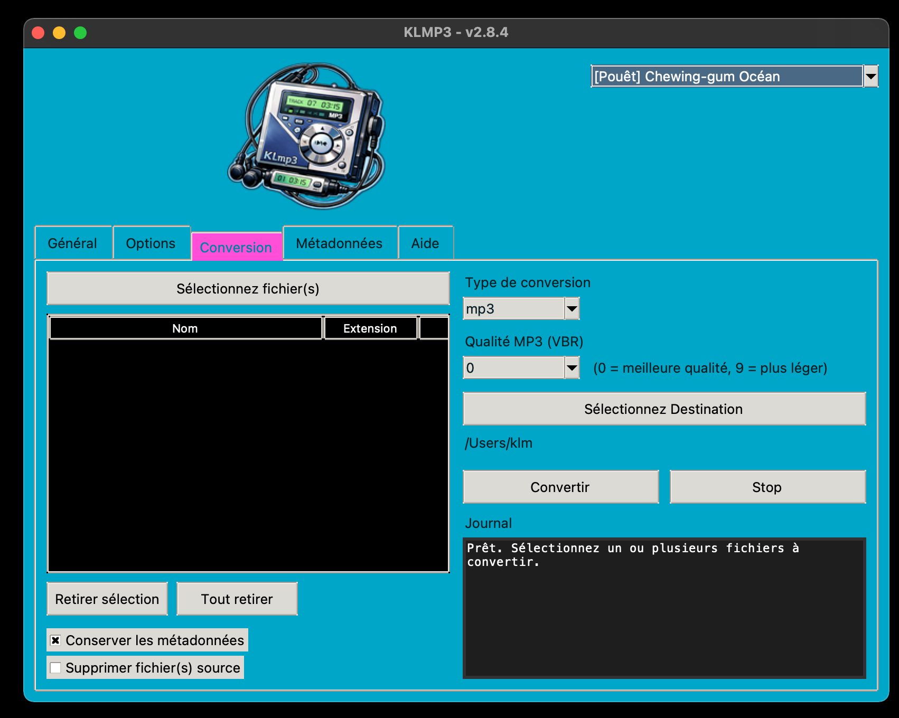
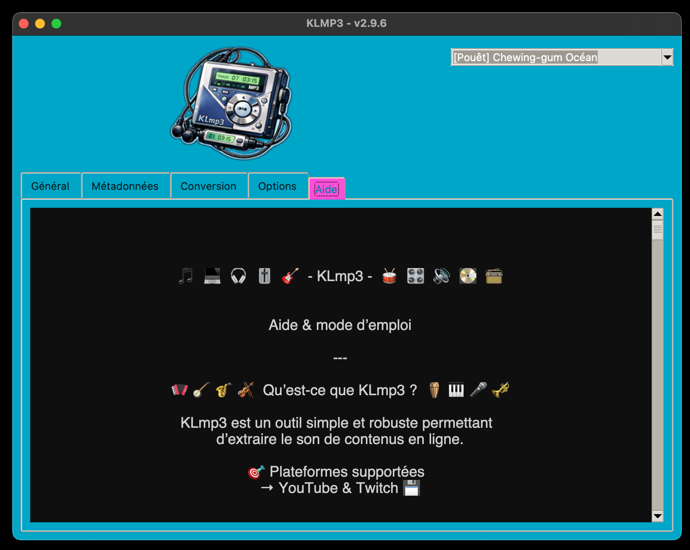

## 🔈️ KLmp3 📢

Extracteur audio YouTube, Twitch, Audiomeans et Podcasts web pour Linux, Windows et macOS.
Objectif : récupérer rapidement de l’audio propre (MP3,M4A,OPUS,FLAC,OGG,WAV) sans dépendre d’un environnement exotique.

---

## 🎙️ Podcasts web : épisodes et séries

Collez l’URL dans le champ habituel, choisissez le dossier et le format de sortie,
puis cliquez sur **Démarrer**.

| URL et mode choisis | Résultat |
| --- | --- |
| Page d’un épisode Blast ou Radio France | Cet épisode uniquement |
| Page d’une série reconnue, mode fichier unique | Premier épisode dans l’ordre de la page |
| Page d’une série reconnue, **La playlist complète** | Épisodes dans l’ordre, avec la limite éventuelle |
| Flux RSS de podcast | Premier épisode ou playlist, dans l’ordre du flux |

**Pour télécharger plusieurs épisodes d’une série, pensez à sélectionner
« La playlist complète ».** La limite maximale est de 1 000 épisodes.

Après application du mode et de la limite :

- **Plusieurs fichiers** : sous-dossier au nom de la série, fichiers numérotés.
- **Un seul fichier** : directement dans le dossier de sortie, sans numéro ajouté.

La conversion et la normalisation restent disponibles. Le titre, l’auteur, la date
et la série sont renseignés lorsque ces informations sont disponibles et que le
format source permet leur insertion. L’option de pochette utilise le visuel fourni
par la source lorsqu’il est disponible.

Le moteur reconnaît les liens audio et les données structurées exposés par les
pages, ainsi que les flux RSS associés. Il prend notamment en charge les épisodes
et séries Blast, et les séries Radio France décrites par une liste structurée
d’épisodes. Il ne suit pas les simples liens de recommandation.

**Limites actuelles :** la pagination des collections et les lecteurs nécessitant
l’exécution de JavaScript ne sont pas gérés. Les séries Radio France annonçant
plusieurs pages sont signalées comme non prises en charge. Un épisode sans audio
arrête la playlist avec un message explicite. La compatibilité avec d’autres sites
dépend des données qu’ils exposent ; la fonction n’est pas universelle.

## 🔄 Mise à jour de KLMP3

Dans **Options**, KLMP3 recherche une version plus récente compatible avec le
système et l’architecture de l’ordinateur. Sur macOS, il vérifie aussi la version
du système requise par le paquet.

Si une nouvelle release existe mais qu’aucun paquet compatible n’est confirmé,
le bouton de téléchargement reste désactivé. Par exemple, un paquet destiné à
macOS récent n’est pas proposé à un utilisateur sous Catalina ou High Sierra.
Une erreur réseau est signalée comme une vérification indisponible.

Cette vérification dépend des informations de compatibilité publiées avec chaque
release. Les futures variantes High Sierra et Catalina restent à construire et
à vérifier ; elles ne sont pas encore produites par le workflow actuel.

La mise à jour de **yt-dlp** utilise un bouton distinct : le filtrage de compatibilité
décrit ici concerne les paquets **KLMP3**.

---

## 👁️ Aperçu







---

## 📥 Téléchargement

## 💾 Applications standalone (recommandé)

Version **2.10.7** : les paquets ci-dessous seront disponibles après réussite
des builds et publication de la release.

- 🐧 **Linux**
  - [KLMP3-2.10.7-linux-x86_64.AppImage](https://github.com/mrklm/klmp3/releases)
  - [KLMP3-2.10.7-linux-x86_64.tar.gz](https://github.com/mrklm/klmp3/releases)
  
- 🍎 **macOS**
  - [KLMP3-2.10.7-macOS-x86_64.dmg](https://github.com/mrklm/klmp3/releases)

- 🪟 **Windows**  
  - [KLMP3-v2.10.7-windows-x86_64.zip](https://github.com/mrklm/klmp3/releases)

---         

## 🧰 Fonctionnalités

🪠 Extraction audio YouTube, Twitch VOD, lecteurs Audiomeans et Podcasts web (notamment Blast et Radio France)

📟️ Conversion des imports au choix en MP3, M4A, OPUS, FLAC, OGG, WAV

🔧 Options de normalisation avancées

📷️ Option de récupération du visuel associé au fichier

🗃️ Choix de telechargement: un fichier ou playlist entière

⚠️ Option nombre de fichiers maximum dans une playlist

📁 Dossier de sortie personnalisable dans l’onglet Général

🗂️ Podcasts web : sous-dossier de série et numérotation si plusieurs épisodes sont sélectionnés

🐚 Onglet de conversion de fichiers 

🏳️‍🌈 Thèmes variés: sombres, clairs et rigolos.

📺️ Interface graphique légère (Tkinter pur)

🦏 Détection robuste de ffmpeg / ffprobe (PATH ou tools/)

⚡️ Fonction de mise à jour de YT-DLP (outil de téléchargement)

⚡️ Recherche automatique d’une mise à jour compatible avec votre ordinateur

🗒️ Journal d’exécution intégré

---

 ## 💊 Dépendances:

Python ≥ 3.9

-yt-dlp (module Python)

-ffmpeg / ffprobe

-Installation de yt-dlp :

-python3 -m pip install --user -U yt-dlp


FFmpeg peut être :

-installé sur le système (PATH)

-ou placé dans tools/<platform>/

--- 

## 🚀 Lancement: 

```bash
python3 klmp3.py
```

Conservez l’ensemble des fichiers du dépôt : les modules de téléchargement,
de mise à jour et les onglets sont répartis dans plusieurs fichiers Python.
Le dossier `assets/` contient notamment les visuels et l’aide ; `tools/` peut
contenir les exécutables embarqués.

--- 

## 🧪 Utilisation depuis les sources (optionnel)

Pour lancer KLMP3 depuis le code source ou contribuer au projet.

## ⚙️ Pré-requis

- Python ≥ 3.9
- Git

---

## 🔧 Installation des dépendances
```bash
python -m pip install -r requirements.txt
```

## 🚀 Lancement
```bash
python klmp3.py
```
## 🏗️ Build (développeurs)
```bash
python -m pip install -r build-requirements.txt
```
---

## ✏️ Notes

Les pages web et lecteurs Audiomeans sont consultés par HTTP ; yt-dlp assure le téléchargement audio.

Le programme ne modifie pas le PATH système

Fonctionne sous  Linux / macOS / Windows

---

## 📜 Licence

Ce logiciel est distribué sous la GNU General Public License v3.0.

---

## 🛠️ Contribuer

Les contributions sont les bienvenues via Pull Requests.

---

## ⚠️ Avertissement

L'utilisation des audios extraits de Youtube & Twitch est
résérvé à un usage **strictement personnel** il ne doit en
aucun cas être diffusé ou partagé.

Ce logiciel est fourni **sans garantie**. L'auteur décline 
toute responsabilité en cas de dommage ou de dysfonctionnement.

---

## 💡 Pourquoi ce projet est-il sous licence libre ?

Ce projet s'inscrit dans la philosophie du logiciel libre, promue par des 
associations comme [April](https://www.april.org/). 

Le partage des connaissances et des outils est essentiel
pour une société numérique plus juste et transparente.

---

## 📬 Contact:

clementmorel@free.fr

---

🎧️ Bonne écoute avec KLmp3 !


## Audiomeans

Collez une URL `https://podcasts.audiomeans.fr/player-v2/<podcast>/episodes/<id>`
ou l’adresse d’une page contenant ce lecteur, puis démarrez le téléchargement.
Les liens intégrés via Embedly et les URL encodées sont reconnus. Le premier
lecteur d’épisode trouvé est téléchargé ; les playlists Audiomeans ne sont pas prises en charge.
La page doit exposer le lecteur dans son HTML. Pour Mediapart, si aucun lecteur
n’est trouvé sur la page publique, KLMP3 réessaie avec les cookies du profil
Firefox par défaut. Connectez-vous au préalable dans Firefox avec un abonnement
donnant accès à l’article. Seuls les cookies Mediapart sont utilisés, en mémoire,
et ils ne sont pas transmis au domaine Audiomeans. Le module Python yt-dlp est
nécessaire pour lire la session, même si le téléchargement utilise le binaire.
Les lecteurs chargés uniquement par JavaScript ne sont pas pris en charge.
En l’absence de lecteur, KLMP3 tente son extraction habituelle avec yt-dlp.

Le lecteur fournit `episode.audio.path` dans `window.__INITIAL_DATA__`.
KLMP3 relit ces données à chaque téléchargement et laisse le serveur audio
rediriger yt-dlp vers le fichier signé. Aucun paramètre de signature n’est
reconstruit ni conservé dans une configuration. Le mode binaire utilise un JSON
privé temporaire, supprimé après exécution, pour transmettre les métadonnées à yt-dlp.
Les liens directs `files.audiomeans.fr` sont également acceptés, mais un lien
signé expiré nécessite de repartir de l’URL du lecteur.

Le titre sert au nom du fichier ; l’option de pochette utilise le visuel du lecteur.
La conversion et la normalisation utilisent le même parcours FFmpeg que les autres sources.

Tests hors réseau (avec les dépendances installées) :

```bash
python -m unittest discover -s tests -v
```

Les tests couvrent Audiomeans, Podcasts web, les séries et leur rangement, les
modes module/binaire de yt-dlp et la sélection des mises à jour compatibles.
Les tests de conversion audio réelle utilisent FFmpeg embarqué lorsqu’il est présent.

## Publication automatique sur GitHub

Le workflow `.github/workflows/release.yml` construit Linux x86_64 (AppImage et
archive tar.gz), Windows x86_64 (ZIP) et macOS Intel (DMG et ZIP).
Il télécharge les outils embarqués, lance les tests et utilise les scripts de build
existants. Les outils sont téléchargés depuis leurs fournisseurs : FFmpeg via
John Van Sickle, Gyan et Evermeet, Deno et yt-dlp via leurs releases GitHub,
et appimagetool via le projet AppImage. Leurs versions sont affichées dans les logs ;
les téléchargements suivent les versions proposées par ces fournisseurs.

Pour publier, mettre à jour `APP_VERSION`, le README et le changelog, puis committer
et pousser les modifications avant de créer le tag correspondant :

```bash
git tag v2.10.7
git push origin v2.10.7
```

Le tag doit correspondre exactement à `APP_VERSION` et à une entrée du changelog.
Après réussite des trois builds, une release est publiée avec les paquets, les
sommes SHA-256 et les notes extraites du changelog. Une release déjà publiée n’est
pas écrasée. Aucun secret supplémentaire n’est requis : le job de publication
utilise le `GITHUB_TOKEN` fourni par GitHub Actions.

Pour essayer les builds sans publier, utiliser **Actions → Build and release →
Run workflow**. Les fichiers restent téléchargeables comme artefacts pendant 14 jours.
Les paquets Windows et macOS ne sont pas signés avec un certificat éditeur ; le
workflow ne réalise pas de notarisation Apple. Les builds distants devront être
validés lors de la première exécution du workflow.

## Développeurs : manifeste de compatibilité

KLMP3 consulte les releases stables et recherche la plus récente compatible avec
son système et son architecture. Pour macOS, la version du système doit respecter
les bornes déclarées pour le paquet. Une release sans manifeste `klmp3-update.json`,
un paquet absent, ou une compatibilité non confirmée ne déclenche pas de proposition
de téléchargement. Une erreur réseau est affichée comme une vérification indisponible.

Le workflow génère des fichiers `compat-<cible>.json`, puis les fusionne dans
`klmp3-update.json` avant publication. La version du manifeste doit correspondre au
tag. Le paquet macOS actuel déclare par prudence la version du système de build
comme minimum ; cela ne certifie pas sa compatibilité avec les systèmes plus anciens.
Les bornes s’appliquent au paquet complet, y compris Python, Tcl/Tk et les outils embarqués.

Pour de futurs builds legacy, produire des paquets aux noms distincts et une
déclaration par variante dans un dossier contenant uniquement ses propres paquets :

```bash
python scripts/update_manifest.py --directory releases-legacy --target macos-x86_64 --variant high-sierra --min-os 10.13
```

La borne ci-dessus est un exemple à utiliser seulement après vérification du build
sur le système visé. Une borne supérieure facultative `--max-os` peut aussi être
précisée (version complète, borne incluse). Rassembler ensuite tous les paquets et
leurs déclarations dans `releases/`, puis exécuter `python scripts/update_manifest.py`
et publier le manifeste fusionné avec les fichiers, dans la même release.
Ne pas remplacer le manifeste complet par celui d’une seule variante. Si plusieurs
paquets conviennent, KLMP3 privilégie celui dont la version minimale est la plus récente.
Aucun build High Sierra ou Catalina n’est encore produit par le workflow actuel.
